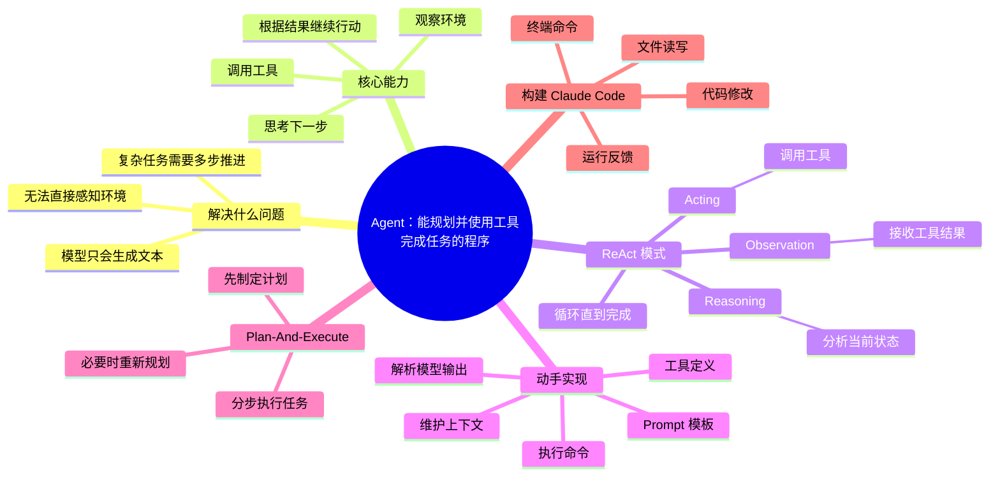
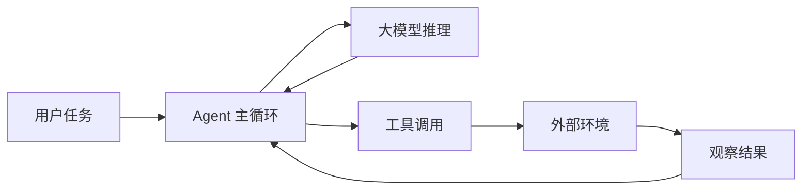
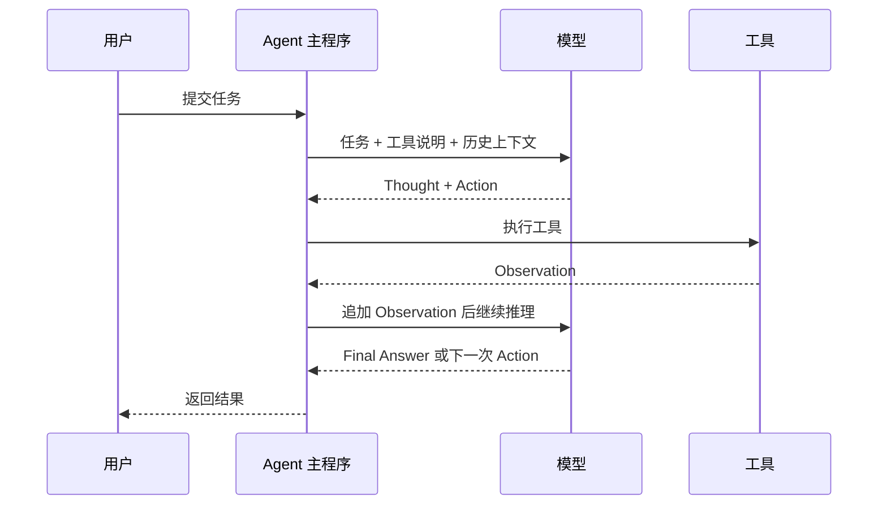
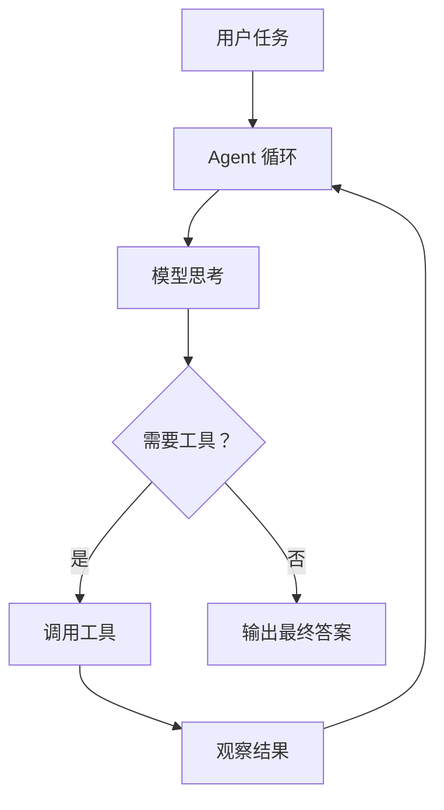

# Agent 的概念、原理与构建模式：从零打造一个简化版 Claude Code

![[assets/agent-concepts-claude-code/cover.jpg]]

> 这期视频以 ReAct 和 Plan-And-Execute 两种模式为主线，解释 Agent 是什么、为什么需要 Agent、Agent 如何借助工具和环境完成任务，并通过实现一个简化版 Claude Code 来展示 Agent 的运行机制。
>
> 说明：该视频没有公开字幕列表，本笔记基于 B 站简介时间轴、播放器章节和关键画面整理，不是逐字稿。

## 整体思维导图



## 视频大纲

| 时间段 | 内容 |
|---|---|
| 00:00-00:33 | 视频内容介绍 |
| 00:33-03:43 | 什么是 Agent |
| 03:43-05:27 | ReAct 模式的运行流程 |
| 05:27-10:49 | ReAct 模式的实现原理 |
| 10:49-18:53 | 动手实现一个 ReAct Agent |
| 18:53-20:21 | ReAct 运行时序图 |
| 20:21-21:20 | Plan-And-Execute 模式介绍 |
| 21:20-28:07 | Plan-And-Execute 运行流程 |

## 核心总结

Agent 不是单纯的大模型，也不是一次性 Prompt。它更像一个“带工具、带循环、能根据反馈继续行动的程序”。

普通 LLM 的能力边界主要在生成文本；Agent 则通过工具调用，把模型的推理能力连接到外部环境，比如文件系统、终端、代码编辑器、搜索、浏览器等。这样它才能完成“读项目、改代码、运行测试、根据报错继续修改”这类多步骤任务。

![[assets/agent-concepts-claude-code/01-agent-questions.jpg]]

## 什么是 Agent

视频里强调了两个常见疑问：

- 什么是 Agent？
- Agent 如何实现？

可以把 Agent 理解成：

> 一个由大模型驱动、能够观察环境、选择行动、调用工具，并根据结果持续推进任务的系统。

它与普通聊天机器人的关键区别在于：Agent 不只是回答问题，还能行动。

![[assets/agent-concepts-claude-code/02-agent-environment.jpg]]

大模型本身无法直接感知和改变外部环境。Agent 的作用，就是在模型和外部世界之间搭建一层执行框架：



## ReAct 模式

ReAct 是 Reasoning and Acting 的缩写。它的核心思想是：让模型在“思考”和“行动”之间循环。

![[assets/agent-concepts-claude-code/03-react-mode.jpg]]

一个典型 ReAct 循环是：

1. **Thought**：模型分析当前任务和已有信息。
2. **Action**：模型选择一个工具，并给出调用参数。
3. **Observation**：系统执行工具，把结果返回给模型。
4. **Repeat**：模型基于新观察继续思考和行动。
5. **Final Answer**：任务完成后输出最终答案。

这个模式特别适合边做边看的任务，比如：

- 读文件后决定下一步改哪里
- 执行命令后根据报错修复
- 搜索资料后继续追问
- 多轮工具调用逐步逼近结果

## ReAct 的实现原理

ReAct 的关键不是“模型天然会操作工具”，而是用 Prompt 和解析规则把模型输出约束成可执行格式。

![[assets/agent-concepts-claude-code/04-react-prompt-principle.jpg]]

实现时通常需要这些组件：

- **Prompt 模板**：告诉模型有哪些工具、输出格式是什么、何时结束。
- **工具列表**：定义每个工具的名称、描述、参数和执行函数。
- **输出解析器**：从模型回复中解析出 Action 和参数。
- **执行器**：真正调用工具，如读文件、写文件、执行 shell 命令。
- **记忆/上下文**：把 Thought、Action、Observation 继续放回对话，让模型能基于历史推进。

简化版伪代码：

```python
while True:
    response = llm(prompt + history)
    if response.has_final_answer():
        return response.final_answer
    action = parse_action(response)
    observation = run_tool(action.name, action.args)
    history.append(response)
    history.append(observation)
```

## 动手实现一个 ReAct Agent

视频中演示了一个简化版 Agent 的实现：让模型可以读取项目文件、执行命令，并逐步完成任务。

![[assets/agent-concepts-claude-code/05-react-agent-running.jpg]]

这类 Agent 的基本骨架是：

1. 接收用户任务。
2. 把任务、工具说明、项目上下文放进 Prompt。
3. 调用大模型，让模型决定下一步。
4. 如果模型要求调用工具，就执行工具。
5. 把执行结果作为 Observation 追加回上下文。
6. 重复直到模型给出最终答案。

![[assets/agent-concepts-claude-code/06-react-code.jpg]]

如果把它类比为 Claude Code，最核心的工具通常包括：

- 读取文件
- 搜索文件
- 修改文件
- 运行命令
- 查看命令输出

Claude Code 的强大之处，不只是模型能力强，而是它把“模型推理 + 工具调用 + 项目反馈”组织成了一个持续循环。

## ReAct 运行时序图

![[assets/agent-concepts-claude-code/07-react-sequence.jpg]]

ReAct 的时序可以总结为：



它的特点是灵活，适合探索式任务；但缺点是可能走弯路，长任务中容易反复试探。

## Plan-And-Execute 模式

Plan-And-Execute 的思路是：先让模型制定计划，再按照计划执行。

![[assets/agent-concepts-claude-code/08-plan-execute.jpg]]

它通常包含两个角色或阶段：

- **Planner**：根据用户任务拆出步骤。
- **Executor**：按照步骤逐个执行，必要时调用工具。

相比 ReAct，Plan-And-Execute 更强调全局规划，适合目标明确、步骤较多的任务。

## Plan-And-Execute 运行流程

Plan-And-Execute 的流程可以概括为：

1. 用户提出复杂任务。
2. Planner 生成执行计划。
3. Executor 执行第一个步骤。
4. 根据执行结果更新状态。
5. 如果计划不再合适，重新规划。
6. 所有步骤完成后输出结果。

![[assets/agent-concepts-claude-code/09-plan-replan.jpg]]

这个模式的优势：

- 更容易让用户看到整体路线。
- 适合拆解复杂任务。
- 可以在执行中检查进度。
- 失败后可以重新规划，而不是一直在同一个循环里试错。

可能的问题：

- 初始计划如果质量差，后续执行会受影响。
- 计划和现实环境可能不一致，需要 Re-Plan。
- 对任务状态管理要求更高。

## ReAct 与 Plan-And-Execute 对比

| 维度 | ReAct | Plan-And-Execute |
|---|---|---|
| 核心思路 | 边思考边行动 | 先规划再执行 |
| 适合任务 | 探索式、反馈驱动任务 | 目标明确、多步骤任务 |
| 优点 | 灵活、即时根据结果调整 | 路线清晰、便于管理进度 |
| 缺点 | 容易绕路或反复尝试 | 计划可能脱离实际，需要重规划 |
| 类比 | 边走边看地图 | 先画路线再出发 |

实际 Agent 系统往往会混合使用两种模式：高层用 Plan-And-Execute 管理任务，底层执行每一步时使用 ReAct 调工具。

## 我的理解

这个视频的核心不是教你背 Agent 定义，而是让你看懂 Agent 的“机械结构”：



一旦理解这个循环，Claude Code、Cline、Cursor、各种 coding agent 的底层逻辑就不再神秘：它们都是在把模型的语言推理能力，放进一个能够读环境、改环境、验证结果的执行框架里。

## 核心结论

- Agent 是“模型 + 工具 + 执行循环 + 环境反馈”的系统。
- ReAct 通过 Thought / Action / Observation 循环，让模型边推理边调用工具。
- 构建 ReAct Agent 的关键是 Prompt 模板、工具定义、输出解析和执行器。
- Claude Code 这类工具本质上就是 coding 场景里的 Agent：读文件、改代码、跑命令、看反馈、继续迭代。
- Plan-And-Execute 更适合复杂任务：先拆计划，再执行步骤，必要时重新规划。
- 真正可用的 Agent 往往不是单一模式，而是规划、执行、工具调用、反馈修正的组合。

## 后续学习建议

- 自己实现一个最小 ReAct Agent：只保留 `read_file`、`list_files`、`run_command` 三个工具。
- 观察 Claude Code 或 Cline 的行为：它什么时候读文件、什么时候执行命令、什么时候停止。
- 学习工具调用的 schema 设计：工具描述越清楚，模型越容易正确调用。
- 继续学习 Plan-And-Execute 与 Re-Plan 机制，理解复杂任务中“计划管理”的价值。
