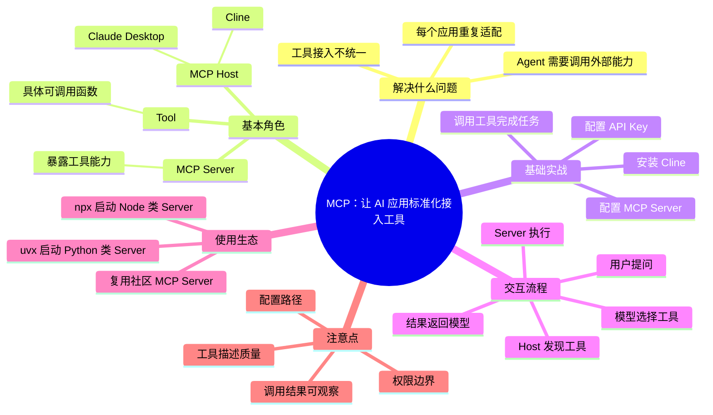
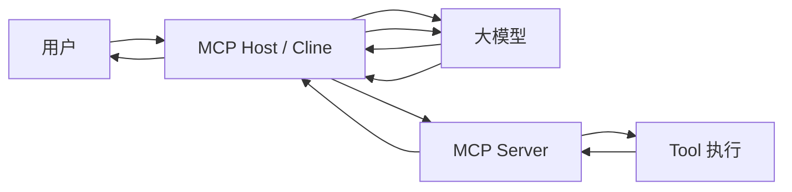

# MCP终极指南：从原理到实战（基础篇）

![[assets/mcp-basic-guide/cover.jpg]]

> 这期视频围绕 MCP 的基础使用展开：先解释 MCP 是什么，再用 Cline 作为 MCP Host 演示如何配置 API Key、提出第一个 MCP 相关问题、理解 MCP Server 和 Tool 的关系，最后演示如何配置、使用以及安装别人做好的 MCP Server。
>
> 说明：该视频没有公开字幕列表，本笔记基于 B 站简介时间轴、播放器章节和关键画面整理，不是逐字稿。

## 整体思维导图

## 视频大纲

| 时间段 | 内容 |
|---|---|
| 00:00-01:03 | 前言 |
| 01:05-02:47 | MCP 简要介绍 |
| 02:47-03:15 | 安装 MCP Host（Cline） |
| 03:15-06:01 | 配置 Cline 用的 API Key |
| 06:01-06:31 | 第一个 MCP 问题 |
| 06:31-09:13 | 概念解释：MCP Server 和 Tool |
| 09:13-14:19 | 配置 MCP Server |
| 14:19-15:24 | 使用 MCP Server |
| 15:24-17:46 | MCP 交互流程详解 |
| 17:46-23:54 | 使用他人制作的 MCP Server：uvx 部分 |
| 23:54-27:06 | 使用他人制作的 MCP Server：npx 部分 |

## 核心总结

MCP 可以理解为一套“AI 应用调用外部工具的标准协议”。它解决的不是“模型本身会不会推理”，而是“模型/Agent 如何以统一方式连接外部世界”。

如果没有 MCP，不同 AI 应用想调用文件系统、数据库、浏览器、搜索、项目管理工具等能力时，往往要各自做一套接入。MCP 的价值在于把工具接入抽象成标准形式，让 Host、Server、Tool 之间用相对统一的方式协作。

![[assets/mcp-basic-guide/02-intro.jpg]]

## 关键概念

### MCP Host

MCP Host 是用户直接使用的 AI 应用或 Agent 环境，它负责承载对话、连接模型、加载 MCP Server，并把工具能力暴露给模型。

视频里主要使用 Cline 作为 MCP Host。

![[assets/mcp-basic-guide/03-install-cline.jpg]]

常见 Host 可以包括：

- Cline
- Claude Desktop
- Cursor 一类 AI 编程环境
- 其他支持 MCP 的 Agent 应用

### MCP Server

MCP Server 是提供工具能力的一端。它可以把某个外部系统、命令行能力、API 或本地资源封装成标准接口，供 Host 和模型调用。

比如一个文件系统 MCP Server 可以提供“读取文件、列目录、写文件”等工具；一个数据库 MCP Server 可以提供“执行查询、查看表结构”等工具。

### Tool

Tool 是 MCP Server 暴露出来的具体能力，可以理解为模型能够调用的函数。

![[assets/mcp-basic-guide/06-server-tool.jpg]]

一个 MCP Server 可以暴露多个 Tool。模型并不是直接“随便操作系统”，而是在 Host 给出的工具列表里选择合适工具，并按工具 schema 传入参数。

## 基础实战流程

### 1. 安装并配置 Cline

视频先演示安装 Cline。Cline 扮演 MCP Host 的角色，也就是连接用户、模型和 MCP Server 的地方。

接着配置 Cline 所需的 API Key，让 Cline 能够调用背后的大模型。

![[assets/mcp-basic-guide/04-api-key.jpg]]

这一部分的重点不是某一个模型供应商，而是理解：Host 需要先能正常连接模型，后面才谈得上让模型调用 MCP 工具。

### 2. 提出第一个 MCP 问题

配置好 Cline 后，视频用一个简单问题验证 Cline 是否能正常工作。

![[assets/mcp-basic-guide/05-first-question.jpg]]

这一步相当于连通性检查：先确认 Host 和模型的基础对话能力正常，再继续配置 MCP Server。

### 3. 配置 MCP Server

配置 MCP Server 时，通常需要告诉 Host：

- Server 名称
- 启动命令
- 启动参数
- 环境变量
- Server 暴露哪些工具

![[assets/mcp-basic-guide/07-config-server.jpg]]

配置完成后，Host 会启动或连接 MCP Server，并读取它提供的工具清单。之后模型在对话中就可以看到这些工具。

### 4. 使用 MCP Server

当用户提出任务后，模型会判断是否需要调用工具。如果需要，Host 会把工具调用请求发给 MCP Server，Server 执行后把结果返回给 Host，最后模型再基于结果继续回答。

![[assets/mcp-basic-guide/09-flow.jpg]]

可以把这个流程理解为：

## MCP 交互流程

视频后半段重点讲解 MCP 的交互链路。抽象出来大概是：

1. Host 启动或连接 MCP Server。
2. Server 向 Host 声明自己有哪些 Tool。
3. 用户向 Host 提出任务。
4. Host 把可用工具信息和用户问题交给模型。
5. 模型决定是否调用工具，以及调用哪个工具。
6. Host 将工具调用转发给 MCP Server。
7. MCP Server 执行 Tool，并返回结果。
8. 模型基于工具结果继续推理或生成最终答案。

这里的关键是：模型不是自己直接执行外部操作，而是通过 Host 和 MCP Server 这条受控链路来调用工具。

## 使用别人做好的 MCP Server

视频还讲了如何使用社区已有的 MCP Server，主要分成两类启动方式。

![[assets/mcp-basic-guide/10-community-server.jpg]]

### uvx

`uvx` 常用于运行 Python 生态里的命令行工具或 MCP Server。它的好处是可以比较方便地按需拉取和运行包，减少手动管理环境的成本。

适合场景：

- MCP Server 是 Python 包
- 文档中给出的启动方式是 `uvx ...`
- 不想手动创建虚拟环境

### npx

`npx` 常用于运行 Node.js 生态里的命令行工具或 MCP Server。

适合场景：

- MCP Server 是 npm 包
- 文档中给出的启动方式是 `npx ...`
- 想快速运行一次 Node 命令行工具

无论是 `uvx` 还是 `npx`，最终目的都是让 Host 能启动对应的 MCP Server，并读取它暴露的工具能力。

## 我的理解

MCP 的价值类似“USB-C 接口”或“插件协议”：它不直接解决所有业务问题，但它让工具接入变得标准化。

对于 Agent 应用来说，MCP 很关键，因为 Agent 不只要会聊天，还要能：

- 读写文件
- 查询资料
- 调用 API
- 操作开发工具
- 和外部系统交互

这些能力如果每个应用都单独适配，会非常混乱；而 MCP 提供了一种更统一的工具接入方式。

## 实践时要注意

1. **先确认 Host 能正常调用模型**：模型配置没通，MCP 后面也无法正常跑。
2. **看清 Server 的启动方式**：Python 生态多见 `uvx`，Node 生态多见 `npx`。
3. **关注权限边界**：文件系统、终端、浏览器、数据库类工具都可能带来安全风险。
4. **工具描述很重要**：模型依赖工具名称、描述和参数 schema 来决定是否调用。
5. **遇到问题先看日志**：MCP Server 启动失败、环境变量错误、命令找不到，都是常见问题。

## 核心结论

- MCP 是 AI 应用和外部工具之间的标准化连接协议。
- Cline 在视频中作为 MCP Host，负责连接用户、模型和 MCP Server。
- MCP Server 负责提供工具能力，Tool 是具体可调用的函数。
- 配置 MCP Server 的核心是启动命令、参数和环境变量。
- 模型调用工具时，会经过 Host -> Server -> Tool -> Server -> Host -> Model 的链路。
- `uvx` 和 `npx` 是复用社区 MCP Server 的两种常见启动方式。

## 后续学习建议

- 继续看该系列的“进阶篇”，理解 MCP Server 的更复杂配置和实战模式。
- 亲自配置一个文件系统类 MCP Server，观察 Cline 如何发现和调用工具。
- 对比 `uvx` 和 `npx` 的启动方式，弄清楚 Python/Node MCP Server 的安装差异。
- 学习 MCP Server 的工具 schema，理解模型为什么能“知道”该怎么传参数。
