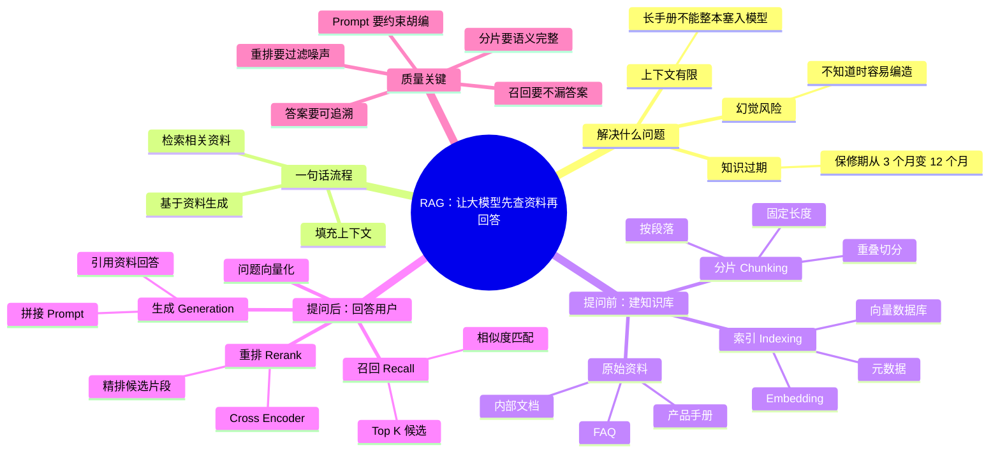
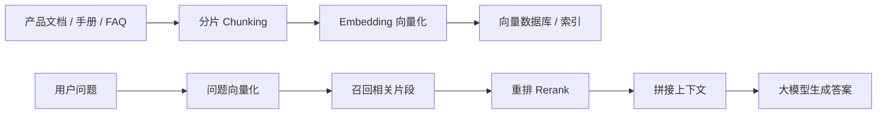
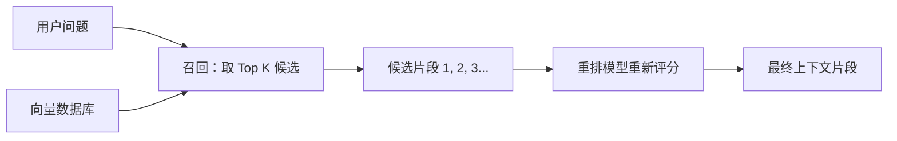

# RAG 工作机制详解：一个高质量知识库背后的技术全流程

![[assets/rag-workflow/cover.jpg]]

## 整体思维导图



> 视频主题：RAG 不是简单地“把文档丢给大模型”，而是一套围绕知识准备、检索、筛选、重排和生成的完整流程。高质量知识库的关键不只在大模型本身，更在于如何把正确的知识片段在正确的时刻交给模型。

## 视频大纲

![[assets/rag-workflow/01-outline.jpg]]

| 时间段 | 内容 |
|---|---|
| 00:00-01:22 | 视频内容简介 |
| 01:22-02:55 | RAG 的使用场景 |
| 02:55-04:19 | RAG 的基本运行流程 |
| 04:19-04:53 | 分片 |
| 04:53-09:40 | 索引 |
| 09:40-13:09 | 召回 |
| 13:09-15:09 | 重排 |
| 15:09-15:27 | 生成 |
| 15:27-17:02 | RAG 的整体流程 |

## 一句话理解 RAG

RAG，全称 Retrieval-Augmented Generation，意思是“检索增强生成”。

它的基本思想是：

1. 先从外部知识库中检索和用户问题相关的内容。
2. 再把这些相关内容和用户问题一起交给大模型。
3. 最后让大模型基于这些上下文生成答案。

所以，RAG 的核心不是让模型“记住所有知识”，而是让模型在回答前能够“查资料”。

## 为什么需要 RAG

视频用“产品手册”和“客服问答”解释了 RAG 的必要性。

![[assets/rag-workflow/02-product-manual-problem.jpg]]

假设用户问：

> 你们产品的保修期是多久？

如果只依赖大模型本身，会遇到几个问题：

1. **模型无法读取所有内容**：产品手册、内部文档、FAQ、历史工单可能很长，不能全部塞进上下文。
2. **模型知识会过期**：产品政策、保修规则、套餐价格经常更新，而模型训练完成后不会自动知道这些变化。
3. **模型可能编造答案**：当模型不知道具体事实时，可能生成看起来合理但并不可靠的回答。

![[assets/rag-workflow/03-stale-knowledge-example.jpg]]

视频里举了一个“产品手册长期更新”的例子：如果产品保修期从 3 个月改成 12 个月，而模型的知识还停留在旧版本，就会回答错误。RAG 的价值就是把最新知识库作为事实来源，让模型基于检索到的材料回答。

## RAG 的两大阶段

RAG 系统可以分成两个阶段：

1. **准备阶段，也叫提问前阶段**：把文档处理好，建立可检索的知识库。
2. **回答阶段，也叫提问后阶段**：用户提问后，检索相关片段，重排，交给模型生成答案。

视频里的整体结构是：



## 第一步：分片

![[assets/rag-workflow/04-chunking.jpg]]

原始文档通常很长，不能直接整篇参与检索，所以要先切成小块，也就是分片。

常见分片方式：

1. **按固定长度分片**：例如每 1000 字切一段。
2. **按段落分片**：更符合自然语义，视频里展示了“按照段落来分”的方式。
3. **带重叠的分片**：相邻片段保留一部分重叠内容，避免关键信息刚好被切断。

分片质量很重要。切得太大，检索不精准；切得太小，语义不完整。好的分片应该尽量保持“一个片段表达一个相对完整的意思”。

## 第二步：索引

索引阶段的目标是：让系统以后能快速找到和问题最相关的知识片段。

视频强调的核心动作是：

1. 用 Embedding 模型把每个文本片段转换成向量。
2. 把向量和原始片段一起存入向量数据库。
3. 查询时也把用户问题转换成向量，再做相似度匹配。

向量可以理解为文本在高维空间里的坐标。语义越接近，向量距离通常越近。

![[assets/rag-workflow/05-vector-similarity.jpg]]

例如：

- “马克喜欢吃水果”
- “马克喜欢吃什么？”
- “马嘉喜欢吃水果”
- “天气真好”

这些句子会被映射成向量。和用户问题语义接近的片段，会在向量空间中更靠近；无关内容距离更远。

## 第三步：召回

召回就是从知识库中先找出一批“可能相关”的候选片段。

![[assets/rag-workflow/06-recall-candidates.jpg]]

基本流程：

1. 用户输入问题。
2. 系统把用户问题转换为向量。
3. 向量数据库计算问题向量和各个片段向量的相似度。
4. 取相似度最高的 Top K 个片段作为候选。

常见相似度算法包括：

- 余弦相似度
- 点积
- 欧氏距离

召回阶段的目标偏向“不要漏掉可能有用的内容”。所以它通常会取一批候选，而不是只取一个片段。

## 第四步：重排

召回得到的候选片段不一定都足够好，也不一定顺序正确，所以需要重排。

![[assets/rag-workflow/07-recall-rerank.jpg]]

召回和重排的区别：

| 阶段 | 作用 | 特点 |
|---|---|---|
| 召回 | 快速找出一批可能相关的片段 | 更快，偏粗筛 |
| 重排 | 对候选片段重新打分排序 | 更精细，偏精准 |

视频里提到，重排可以使用 cross-encoder 一类模型。它会更细致地判断“用户问题”和“候选片段”之间的相关性，从而把最有用的片段排到前面。

可以这样理解：



## 第五步：生成

![[assets/rag-workflow/08-generation.jpg]]

生成阶段会把三类信息组合起来：

1. 用户的问题。
2. 召回并重排后的相关片段。
3. 给大模型的指令，例如“只能根据参考资料回答，不知道就说不知道”。

然后大模型基于这些上下文生成最终答案。

一个典型 Prompt 结构可以写成：

```text
你是一个客服助手。请仅根据下面的资料回答用户问题。
如果资料中没有答案，请说明“当前资料中没有找到相关信息”。

用户问题：
{question}

参考资料：
{retrieved_context}

请给出简洁、准确的回答。
```

这样做的好处是：模型不需要凭记忆回答，而是基于检索到的知识片段回答，答案更容易追溯和更新。

## 完整流程回顾

![[assets/rag-workflow/09-overall-flow.jpg]]

RAG 的完整流程可以拆成两条线。

### 提问前：知识库准备

1. 收集原始资料：产品手册、FAQ、内部文档、工单记录等。
2. 清洗文本：去掉无关格式、重复内容、噪声。
3. 分片：把长文档切成适合检索的小片段。
4. Embedding：把片段转换成向量。
5. 入库：把文本片段、向量、来源信息、更新时间等元数据存入向量数据库。

### 提问后：检索并生成

1. 用户提出问题。
2. 把问题转换为向量。
3. 在向量数据库中召回相关片段。
4. 对候选片段重排。
5. 拼接上下文和用户问题。
6. 大模型生成答案。
7. 返回答案，必要时附上引用来源。

## 工程实践里的关键点

### 分片策略决定检索质量

如果分片不合理，即使后面的向量数据库和大模型很强，也可能拿不到正确上下文。

常见优化方向：

- 按标题、段落、语义边界切分。
- 给相邻片段加 overlap。
- 保留文档标题、章节、页码、更新时间等元数据。
- 对表格、代码、FAQ 使用不同的分片策略。

### 召回要兼顾准确率和覆盖率

召回片段太少，容易漏答案；召回太多，后续上下文会冗余，甚至干扰模型。

通常可以先召回较多候选，再通过重排压缩到少量高质量片段。

### 重排是提升答案质量的重要环节

向量召回擅长快速粗筛，但不一定能精确理解复杂问题。重排模型可以重新判断候选片段和问题的匹配程度，让最终进入 Prompt 的内容更干净。

### 生成阶段要控制模型行为

RAG 不是把片段塞给模型就结束了。Prompt 里应该明确：

- 只能基于参考资料回答。
- 资料不足时不要编造。
- 回答要简洁还是详细。
- 是否需要列出来源。
- 是否需要按固定格式输出。

## 这节视频可以记住的核心结论

1. RAG 的本质是“先检索，再生成”。
2. RAG 解决的是大模型知识过期、上下文有限、容易幻觉的问题。
3. 一个高质量 RAG 系统不只依赖大模型，还依赖分片、索引、召回、重排、Prompt 设计等多个环节。
4. 分片和索引属于提问前的准备流程；召回、重排和生成属于提问后的回答流程。
5. 向量数据库负责快速找到语义相近的片段，重排模型负责从候选片段里挑出更相关的内容。
6. 最终答案质量取决于“能否找到正确资料”和“能否让模型基于资料回答”。

## 后续学习建议

- 继续学习 Embedding 模型：理解为什么文本可以被表示成向量。
- 实践一个最小 RAG：文档分片、向量化、入库、召回、拼 Prompt。
- 对比不同分片大小、Top K、重排策略对答案质量的影响。
- 学习如何给 RAG 答案加引用来源，方便追溯和验证。
- 进一步学习混合检索：向量检索 + 关键词检索，以提升复杂查询效果。
